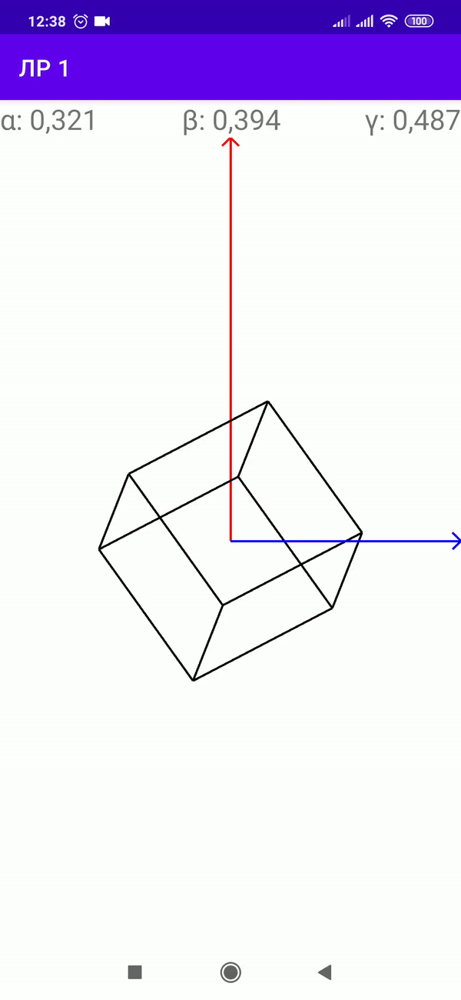

### Visualzation of sensors values

This project represent simple visualization of rotation type vector. Getting values from 
sensors use for rotate cube. Code is written using Java and Android API's.

